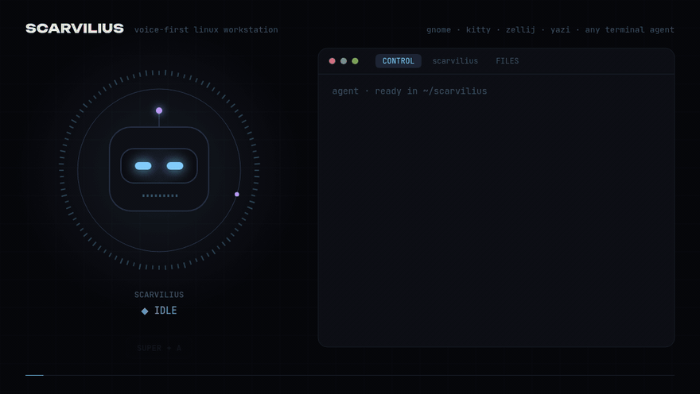
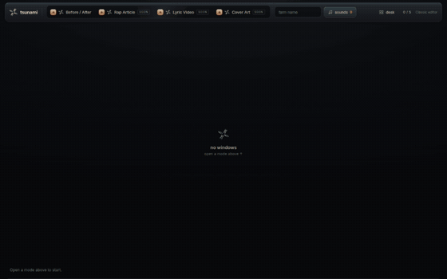
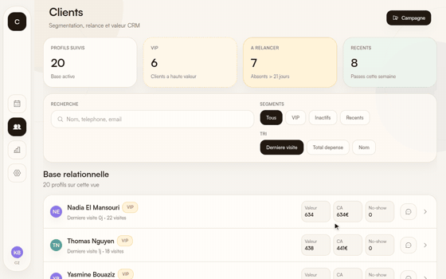
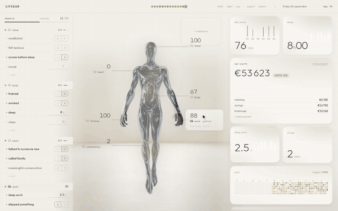
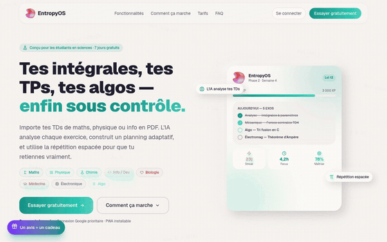
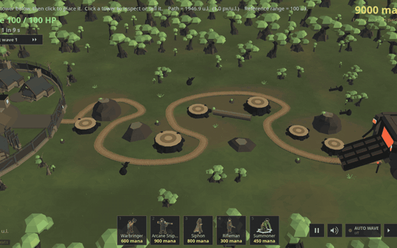

<picture>
  <source media="(prefers-color-scheme: dark)" srcset="assets/header-dark.svg">
  <source media="(prefers-color-scheme: light)" srcset="assets/header-light.svg">
  
</picture>

 

I like software that keeps going after I close the laptop: pipelines that find their own work,
tools that keep your data on your machine, and the occasional game. Here is what I've built and
what I've helped build.

 

<table>
  <tr>
    <td colspan="2" valign="top">
      
      <h3><a href="https://github.com/Sc4rville/scarvilius">Scarvilius</a></h3>
      

      My whole workstation, open-sourced. Press a key, talk, and the words land in the right window, the
      right zellij pane, or straight into a terminal coding agent, delivered and verified. There are also
      screenshot shortcuts, an agent-ready zellij workspace, and a 40-assertion selftest.
      

      
Bash · Python · GNOME Wayland · zellij · kitty

    </td>
  </tr>
  <tr>
    <td width="50%" valign="top">
      
      <h3><a href="https://github.com/Sc4rville/lastwebstudios">LastWebStudios</a></h3>
      

      An autonomous web studio. It finds businesses with a weak website, rebuilds the site from
      their own content, pitches with the finished result, and learns from every cycle.
      

      
TypeScript · Node · Playwright · LLM

    </td>
    <td width="50%" valign="top">
      
      <h3><a href="https://github.com/Sc4rville/tsunami">tsunami</a></h3>
      

      Drop a song, get a batch of 9:16 before/after videos, each one cutting on the drop. The same
      face carries through from before to after.
      

      
Python · ffmpeg · numpy · vanilla JS

    </td>
  </tr>
  <tr>
    <td width="50%" valign="top">
      
      <h3><a href="https://github.com/Sc4rville/cizo">Cizo</a></h3>
      

      Software for hair salons and barbershops, with an agenda that follows the real day: when a
      client runs late or a cut overruns, the schedule shows it live. Clients, campaigns and KPIs sit alongside.
      

      
React Native · Expo · TypeScript · Supabase

    </td>
    <td width="50%" valign="top">
      
      <h3><a href="https://github.com/Sc4rville/lifebar">lifebar</a></h3>
      

      Your life as an instrument panel. A 30-second daily check-in, and a figure whose body lights up
      where you're thriving or slipping. Everything stays in your browser.
      

      
React 19 · TypeScript · Vite · SVG

    </td>
  </tr>
  <tr>
    <td width="50%" valign="top">
      
      <h3><a href="https://github.com/Sc4rville/entropy">Entropy</a> with <a href="https://github.com/kabylesystem">@kabylesystem</a></h3>
      

      A study planner for science students. Import your course PDFs: every exercise is found, ranked
      by exam value and scheduled backwards from exam day, with spaced repetition. Built as a collab.
      

      
Next.js · React 19 · Supabase · Three.js

    </td>
    <td width="50%" valign="top">
      
      <h3><a href="https://github.com/Sc4rville/tower-defense">Tower Defense</a></h3>
      

      A 3D tower defense in plain JavaScript and hand-written WebGL, with five towers, deep upgrade trees
      and 35 waves. It runs straight from <code>file://</code>, with no build step.
      

      
JavaScript · WebGL · Blender

    </td>
  </tr>
</table>

 

### How I build

- **Mocks first, keys last.** A pipeline should run end to end on fakes before it touches a paid API,
  so a missing key never blocks you from trying it.
- **Local-first by default.** Your data lives in your browser or on your disk until you decide otherwise.
- **Loops over demos.** Whatever I ship should measure its own output and get better the next time
  round.

### Toolbox

<code>TypeScript</code> <code>React</code> <code>Next.js</code> <code>Node</code> <code>Python</code>
<code>Three.js</code> <code>WebGL</code> <code>Supabase</code> <code>Postgres</code>
<code>Playwright</code> <code>ffmpeg</code> <code>Linux</code>

 

Every repo has a quick start. Clone it, break it, tell me.

