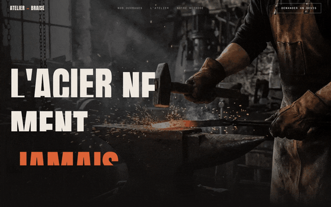
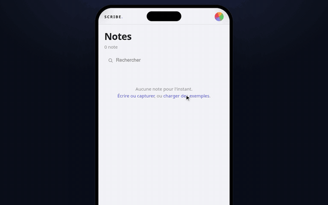

<picture>
  <source media="(prefers-color-scheme: dark)" srcset="assets/header-dark.svg">
  <source media="(prefers-color-scheme: light)" srcset="assets/header-light.svg">
  
</picture>

 

I like software that keeps going after I close the laptop: pipelines that find their own work,
tools that keep your data on your machine, and the occasional game. Here is what I've built and
what I've helped build.

 

<table>
  <tr>
    <td width="50%" valign="top">
      
      <h3><a href="https://github.com/Sc4rville/lastwebstudios">GENESIS</a></h3>
      An autonomous web studio. It finds businesses with weak websites, builds each one a demo
      from its own content, pitches with the finished site, and learns from every reply.
       <code>TypeScript</code> <code>Node</code> <code>Playwright</code> <code>Postgres</code>
    </td>
    <td width="50%" valign="top">
      
      <h3><a href="https://github.com/Sc4rville/tsunami">tsunami</a></h3>
      Drop a song, get a batch of 9:16 glow-up videos: the same face from baby to adult, with the
      cut landing on the kick.
       <code>Python</code> <code>ffmpeg</code> <code>image models</code>
    </td>
  </tr>
  <tr>
    <td width="50%" valign="top">
      
      <h3><a href="https://github.com/Sc4rville/scribe">scribe</a></h3>
      Photograph a page of your paper notebook. Tasks, events, contacts and ideas are pulled out and
      filed where they belong, without a single tap after the capture.
       <code>TypeScript</code> <code>Hono</code> <code>Zod</code> <code>Postgres</code>
    </td>
    <td width="50%" valign="top">
      
      <h3><a href="https://github.com/Sc4rville/lifebar">lifebar</a></h3>
      A whole life on one screen: keyboard-only daily check-ins, an annotated figure, and a bento of
      money, sleep and deep work. Everything stays in your browser.
       <code>React 19</code> <code>TypeScript</code> <code>Vite</code> <code>SVG</code>
    </td>
  </tr>
  <tr>
    <td width="50%" valign="top">
      
      <h3><a href="https://github.com/Sc4rville/entropy">Entropy</a> with <a href="https://github.com/kabylesystem">@kabylesystem</a></h3>
      A study planner for STEM students. Import your problem sheets as PDFs; every exercise gets
      rated and scheduled with spaced repetition, all the way to exam day.
       <code>Next.js</code> <code>React 19</code> <code>Supabase</code> <code>Three.js</code>
    </td>
    <td width="50%" valign="top">
      
      <h3><a href="https://github.com/Makzura/tower-defense">Tower Defense</a> by <a href="https://github.com/Makzura">@Makzura</a></h3>
      A 3D tower defense in plain JavaScript and WebGL, with deep upgrade trees. It runs straight from
      <code>file://</code>, with no build step.
       <code>JavaScript</code> <code>WebGL</code> <code>Blender</code>
    </td>
  </tr>
</table>

 

### How I build

- **Mocks first, keys last.** Every pipeline runs end to end on fakes before it touches a paid API,
  so a missing service never blocks the run.
- **Local-first by default.** Your data lives in your browser or on your disk until you decide otherwise.
- **Loops over demos.** Whatever I ship should measure its own output and get better the next time
  round.

### Toolbox

<code>TypeScript</code> <code>React</code> <code>Next.js</code> <code>Node</code> <code>Python</code>
<code>Three.js</code> <code>WebGL</code> <code>Supabase</code> <code>Postgres</code>
<code>Playwright</code> <code>ffmpeg</code> <code>Linux</code>

 

Everything above runs locally. Clone it, break it, tell me.

